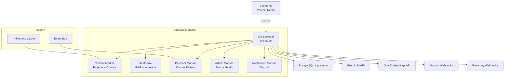

# Architecture Overview

Smart Portfolio features a clean, modular backend architecture written in Go. It is designed to be highly concurrent, robust, and easy to maintain, following domain-driven design principles.

## System Diagram

## Key Design Decisions

### 1. Modular Monolith
The codebase is structured into distinct, self-contained modules (`content`, `ai`, `payment`, `admin`, `notification`) under `internal/modules/`. Each module encapsulates its own routes, handlers, services, repositories, models, and DTOs. This approach prevents tightly coupled "spaghetti code" while avoiding the overhead of managing microservices.

### 2. Interface-Driven Services
Services expose interfaces at the top of their files. Handlers consume these interfaces rather than concrete structs. This enables easy swapping of implementations (e.g., replacing Groq with OpenAI, or Discord with Slack) and simplifies mocking during unit testing.

### 3. Concurrency
Go's lightweight goroutines are heavily utilized to keep the API fast and responsive:
- **Embedding Batches:** PDF chunks are embedded in parallel using a semaphore channel to limit concurrent Jina API calls.
- **Async Notifications:** Every Discord webhook call runs in its own goroutine, tracked by a `sync.WaitGroup`, ensuring the HTTP response is never blocked by a slow notification.
- **Event Dispatching:** The in-process event bus invokes each subscriber in its own goroutine, wrapped in a panic recovery block.
- **Background Workers:** The outbox poller and semantic cache flusher operate autonomously in background loops.

### 4. Transactional Outbox Pattern
Handling third-party payment webhooks (Razorpay) demands high reliability. To ensure that every successful payment results in an internal event (like a Discord notification) without edge-case failures, the backend employs the **Transactional Outbox Pattern**. The payment record and an "outbox event" are committed simultaneously in a single PostgreSQL transaction. A background poller then reliably processes the outbox.

### 5. Graceful Shutdown
When the server receives a `SIGINT` or `SIGTERM`, it orchestrates a clean shutdown:
1. Stops accepting new HTTP requests.
2. Drains in-flight requests.
3. Stops the background outbox poller.
4. Waits for the event bus and notification webhooks to finish processing.
5. Flushes the semantic cache to the database.
6. Closes the PostgreSQL connection pool.
