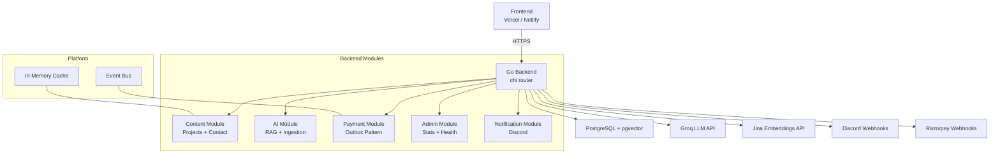

---
hide:
  - navigation
  - toc
---

<div class="hero" markdown>

# :rocket: Smart Portfolio

**A full-stack developer portfolio with AI-powered resume chat, project showcase, contact form, and sponsorship payments.**

Built with Go, PostgreSQL + pgvector, Groq LLM, and Jina Embeddings.

[Get Started :material-arrow-right:](guide/index.md){ .md-button .md-button--primary }
[API Reference :material-book-open-variant:](api/index.md){ .md-button }
[View on GitHub :fontawesome-brands-github:](https://github.com/ZRishu/smart-portfolio){ .md-button }

</div>

---

## Features

<div class="feature-grid" markdown>

<div class="feature-card" markdown>

### :material-robot: AI Resume Chat (RAG)

Upload a PDF resume — it's chunked, embedded via Jina, and stored in pgvector. Visitors ask questions and get LLM-powered answers from Groq with real-time SSE streaming. A semantic cache avoids redundant LLM calls.

</div>

<div class="feature-card" markdown>

### :material-folder-multiple: Project Showcase

Full CRUD for portfolio projects with in-memory caching (24h TTL). Cache auto-invalidates on writes so reads are always fast and consistent.

</div>

<div class="feature-card" markdown>

### :material-email-outline: Contact Form

Visitors submit messages through a contact form. Messages are persisted to PostgreSQL and an async Discord notification fires in a background goroutine.

</div>

<div class="feature-card" markdown>

### :material-cash-multiple: Sponsorship Payments

Razorpay webhooks with HMAC-SHA256 verification. The transactional outbox pattern guarantees reliable event delivery with Discord alerts for every new sponsor.

</div>

<div class="feature-card" markdown>

### :material-shield-lock: Admin Dashboard API

Aggregate stats from all modules, sponsor listing, deep health check with DB latency — all behind API key authentication with constant-time comparison.

</div>

<div class="feature-card" markdown>

### :material-file-document: Interactive API Docs

Swagger UI served at `/docs` with a comprehensive OpenAPI 3.0 spec. Every endpoint, schema, and error response is documented and testable from the browser.

</div>

</div>

---

## Tech Stack

| Layer | Technology |
|-------|-----------|
| **Language** | Go 1.25 |
| **Router** | chi/v5 |
| **Database** | PostgreSQL 16 + pgvector (pgx/v5) |
| **AI / LLM** | Groq (OpenAI-compatible) |
| **Embeddings** | Jina Embeddings v2 |
| **Logging** | zerolog (structured, request-ID correlated) |
| **Payments** | Razorpay webhooks |
| **Notifications** | Discord webhooks |
| **Caching** | go-cache (in-memory, TTL-based) |
| **API Docs** | OpenAPI 3.0 + embedded Swagger UI |
| **CI/CD** | GitHub Actions → GHCR + GitHub Releases |
| **Deployment** | Docker (~11 MB image), Railway / Render / Fly.io / VPS |

---

## Architecture



---

## Quick Start

!!! tip "Fastest path: Docker Compose"

    ```bash
    cd backend
    cp .env.example .env
    # Edit .env — set GROQ_API_KEY and JINA_API_KEY

    docker compose up -d --build
    ```

    Server: [http://localhost:8080](http://localhost:8080){ target="_blank" }
    · API Docs: [http://localhost:8080/docs](http://localhost:8080/docs){ target="_blank" }
    · Health: [http://localhost:8080/healthz](http://localhost:8080/healthz){ target="_blank" }

For detailed setup instructions, see the [Complete Guide](guide/index.md).

---

## Project Structure

```text
smart-portfolio/
├── .github/workflows/       CI/CD pipelines
│   ├── ci.yml               Lint → Test → Build (every push/PR)
│   └── cd.yml               Docker push + GitHub Release (on tags)
├── backend/                  Go REST API
│   ├── cmd/server/           Entry point & DI wiring
│   ├── docs/                 OpenAPI spec + Swagger UI handler
│   ├── internal/             Application code (config, modules, platform)
│   ├── migrations/           SQL migration files
│   ├── Dockerfile            Multi-stage production build
│   ├── docker-compose.yml    Local dev stack (app + PostgreSQL)
│   └── Makefile              Build, test, lint, Docker targets
├── frontend/                 Frontend application
├── docs/                     This documentation site (MkDocs)
├── mkdocs.yml                MkDocs configuration
├── GUIDE.md                  Standalone complete guide
└── README.md                 Project overview
```

---

<div style="text-align: center; padding: 2rem 0;" markdown>

[Read the Full Guide :material-book-open-page-variant:](guide/index.md){ .md-button .md-button--primary }

</div>